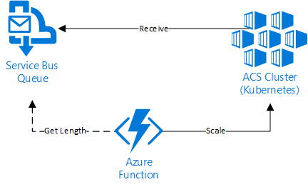
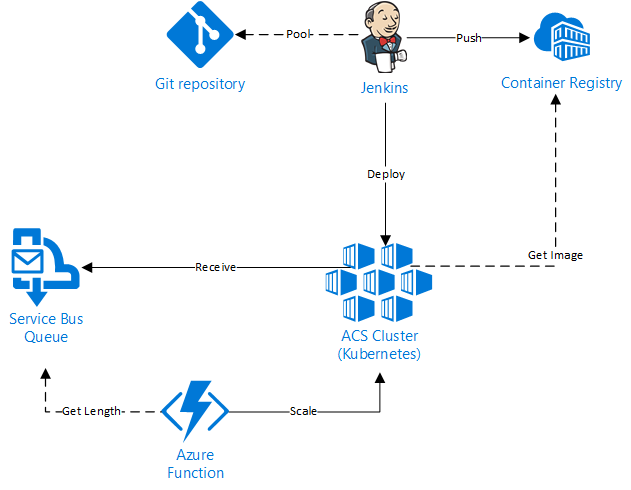

# Container Nanny
Monitoring solution for autoscaling Kubernetes containers jobs based on Service Bus Queue size.

## Architecture

### Basic Architecture

The proposed solution uses an Azure Function to get the message count from a Service Bus Queue. Is is triggered every n minutes. If there is any message, Function calls Kubernetes API in order to scale it up, creating a job on Kube.

Every job has the following pattern: It continuously peek, process and delete messages from queue. If there is no messages in a definied interval, the process finishes.

### Basic Architecture + DevOps Included

The solution above can be extended to embrace a DevOps process. In the following proposed architecture a Jenkins instance is triggered by a git repository. Then it builds the container image and pushes to an Azure Container Registry. Right after, Jenkins calls Kubernetes API and notifies the new container image.

## Documentation (/docs):

1. [Kubernetes Setup](./docs/1_KubernetesSetup.md)
2. [Certificate Setup](./docs/2_CertificateSetup.md)
3. [SDK Development](./docs/3_SDKDevelopment.md)
4. [Function Development](./docs/4_FunctionDevelopment.md)
5. [Deployment and Jobs](./docs/5_DeploymentandJobs.md)

## Projects 

### Library (/src)
This .NET Full library implements:
* Authentication
* Deployments scaling
* Jobs creation

### Azure Function (/src)
The C# Azure Function with the following code snippets:
* Kube.csx: handles calls to Kuber.NET private assembly
* Queue.csx: handles calls to Service Bus Queue using its SDK
* Settings.csx: stores all settings related to the project
* run.csx: business logic inside container scaling rules

### Example\Queue:
* Queue.Checker: Check if there is any item in a Queue and use Kuber.NET to increase the number of containers (.NET Full, Project to be deploy inside an Azure Function)
* Queue.Producer: Inserts items in Service Bus Queue (.NET Full, Simulate other enviroment microservices)
* Queue.Consumer: Reads items in Service Bus Queue (.NET Core, Simulate container inside Kubernetes)

### Scripts
Scripts for automation (used in our Jenkins instance).
* buildandpush.sh: Builds the .NET core project, create the docker image and deploys it to Azure Container Registry.
* buildimage_example.sh: Example that uses the script above.
* deployment_template.yaml: Uses a previously built image from Azure Container Registry and creates a Deployment on Kubernetes.
* job_template.yaml: Uses a previously built image from Azure Container Registry and creates a Job on Kubernetes. 

## References
* [Azure Functions](https://docs.microsoft.com/en-us/azure/azure-functions/functions-overview)
* [Azure Container Service](https://docs.microsoft.com/en-us/azure/container-service/kubernetes/)
* [Azure Container Registry](https://docs.microsoft.com/en-us/azure/container-registry/)
* [Service Bus Queue](https://docs.microsoft.com/en-us/azure/service-bus-messaging/service-bus-queues-topics-subscriptions)
* [Kubernetes](https://kubernetes.io/docs/home/)
* [Kubernetes Jobs](https://kubernetes.io/docs/concepts/workloads/controllers/jobs-run-to-completion/)
* [Kubernetes API Authentication](https://kubernetes.io/docs/admin/authentication/)
* [Jenkins integration with ACS and Kubernetes](https://docs.microsoft.com/en-us/azure/container-service/kubernetes/container-service-kubernetes-jenkins)
