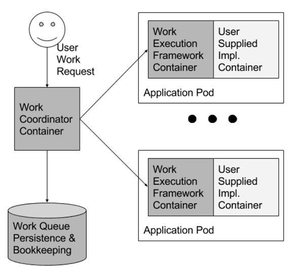

# Container Nanny
Container Nanny is a Kubernetes job autoscaler solution based on queue size.

### Status

| Version                             | Status                         | Code Review                    | License
|-----------------------------------	| ------------------------------ | ------------------------------ | ------------------------------
| 0.1.0                               | [](https://travis-ci.org/CSELATAM/ContainerNanny) | [](https://www.codefactor.io/repository/github/cselatam/containernanny) | [](https://github.com/CSELATAM/ContainerNanny/blob/master/LICENSE)

## Work Queue Pattern

As mentioned on the work of Brendan Burns and David Oppenheimer, "[Design patterns for container-based distributed systems](https://static.googleusercontent.com/media/research.google.com/en//pubs/archive/45406.pdf)", the section *Work queue pattern* says:

> *"Although work queues, like leader election, are a well-studied
subject with many frameworks implementing
them, they too are an example of a distributed system
pattern that can benefit from container-oriented architectures.
In previous systems, the framework limited programs
to a single language environment (e.g. Celery for
Python [13]), or the distribution of work and binary were
exercises left to the implementer (e.g. Condor [21]). The
availability of containers that implement the run() and
mount() interfaces makes it fairly straightforward to implement
a generic work queue framework that can take
arbitrary processing code packaged as a container, and
arbitrary data, and build a complete work queue system.
The developer only has to build a container that can take
an input data file on the filesystem, and transform it to an
output file; this container would become one stage of the
work queue. All of the other work involved in developing
a complete work queue can be handled by the generic
work queue framework that can be reused whenever such
a system is needed. The manner in which a user’s code
integrates into this shared work queue framework is illustrated
in Figure 4."*
> 

Container Nanny is a *generic
work queue framework that can be reused whenever such
a system is needed*. It's developed in C# and it's designed to be highly configurable.

## Quick Start

Use the following `helm` command to install it:

```bash
helm install https://github.com/CSELATAM/ContainerNanny/releases/download/v0.1.0/helm-container-nanny-0.1.0.tgz \
	--set settings.QUEUE_CONNECTION_STRING="YOUR VALUES" \
	--set settings.QUEUE_NAME="YOUR VALUES" \
	--set settings.K8S_CR_SECRET="YOUR VALUES" \
	--set settings.JOB_CONTAINER_IMAGE="YOUR VALUES"
```

## Architecture

TODO: Describe.

## Project Structure

### Documentation (/docs)

TODO: Describe.

### Source Code (/src)

TODO: Describe.

### Examples (/examples)

The repository also have some examples to help you develop and implement the queue pattern on your client. Currently we have:

* azure-service-bus-consumer
* azure-queue-storage-consumer

## Roadmap

The roadmap include the following tasks:

* Support Kafka as a queue client.
* Support SQS as a queue client.
* Use Kubeless to extend scaling rules.

If you find any need that the project currently doesn't support, please feel free to open an issue or a pull request!
