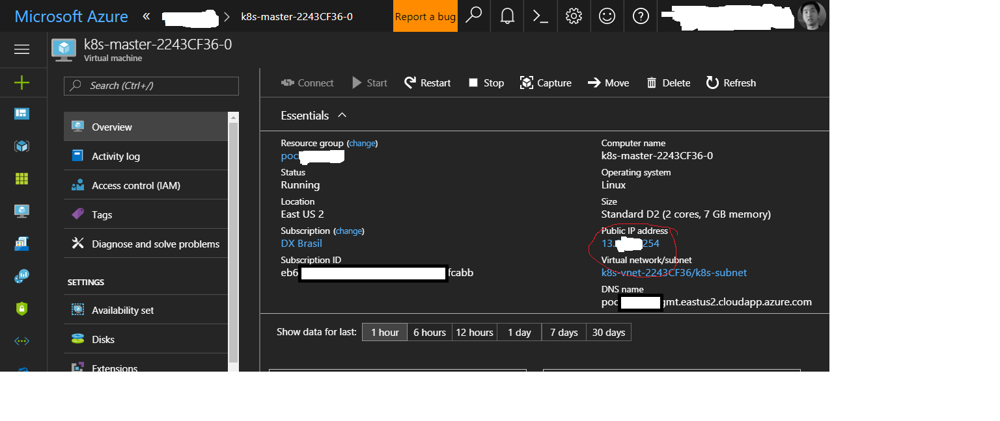
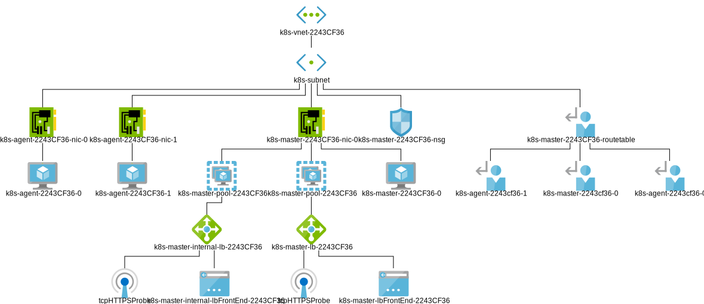
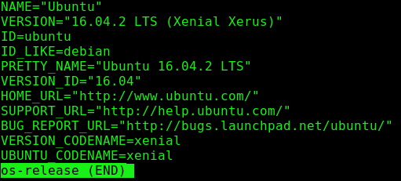
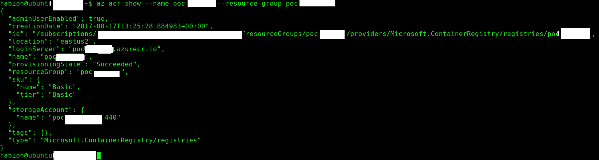
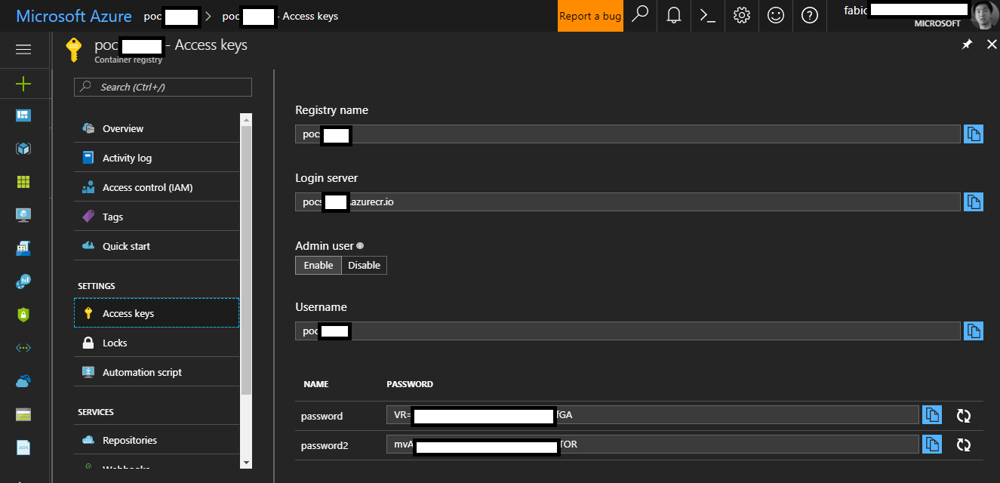

# Kubernetes Deployment using Azure Container Services (ACS)
The entire process to deploy is documented on the following repository:

https://github.com/fabioharams/kubernetes

This is the main requirement and after the deployment you can continue following procedures on this documentation.
A copy of this documentation is provided on this repository [here](../docs/0_InitialDeployment.md)


# Manage Kubernetes Cluster on ACS

This documentation will provide procedures to connect on Kubernetes Master already deployed on Azure Container Services (ACS). If you want to deploy your own K8s cluster via ACS follow the procedures on this documentation [here].(https://github.com/fabioharams/kubernetes)

The machine used to deploy your K8s cluster on ACS holds the certificates to manage the environment. We suggest you to deploy a virtual machine on the same Resource Group used by K8s to execute all commands. This virtual machine will contains Azure CLI and Kubectl. The procedures bellow are based on Ubuntu 16.04 LTS.


## How to connect on Kubernetes Master

The procedures described [here](https://github.com/DXBrazil/Kuber.NET/blob/master/docs/2_LinuxCertificateSetup.md) will require a connection on Kubernetes Master to get the certificates and copy to other machine. Using the Linux VM on Azure used to deploy K8s on ACS you can direct connect through SSH on Kubernetes Master. This is achieved due to the credentials stored due to the process of ACS deployment (described [here](https://github.com/fabioharams/kubernetes)).

1. Finding public IP Address of K8s Master



> Information about the real IP Address and other things were removed

2. Open console and connect via SSH


> By default the ACS create an user called _azureuser_ on K8s cluster. Also the required certificate to connect on K8s cluster was already stored locally (when you execute the command get-credentials via Azure-CLI after the installation of kubectl).

> Information about the real IP Address and other things were removed

3. Follow the procedures [here](https://github.com/DXBrazil/Kuber.NET/blob/master/docs/2_LinuxCertificateSetup.md) to finish your setup


## Visualize the network topology

You can visualize the entire topology of K8s Cluster on ACS using [Azure Network Watcher](https://azure.microsoft.com/en-us/services/network-watcher/). This is very useful to better understand what is already deployed and troubleshooting. Follow the instructions described [here](https://docs.microsoft.com/en-us/azure/network-watcher/network-watcher-create) to prepare your subscription (and Region) to support Azure Network Watcher. Also you can download the network topology (SVG file). 




## Transfer files from/to K8s Master

Instead of using the command `kubectl cp` to copy files you can use Azure Files to easily transfer files. This is important if you want to transfer files from K8s Master and other computers via Internet. 

Use [this documentation](https://docs.microsoft.com/en-us/azure/storage/storage-how-to-use-files-linux) to mount and SMB Share and connect your K8s Master. You don't  need to install `cifs-utils` because it's already installed.

> Note: ACS use Ubuntu OS to deploy Kubernetes. You can check the version running the following command on `etc` K8s Master´s folder:

```
cat os-release
```




## Deploying Azure Container Registry

You can create a private container registry for your environment using Azure Container Registry. Until the date of this documentation (21-Aug-17) the Managed Registry was in Preview. You can choose an variety of options including Basic, Standard or Premium. 

Follow the procedures [here](https://docs.microsoft.com/en-us/azure/container-registry/container-registry-managed-get-started-portal) to create your Azure Container Registry.



* Log in to Azure Container Registry
```
docker login yourprivatergistry.azurecr.io -u username -p password
```



Notes: until the release of this documentation (Aug-2017) you cannot delete images on ACR. However you can delete the entire repository or remove the tag. Native Docker has the same issue. If you want more information please follow these discussions 

https://github.com/Azure/acr/issues/33

https://docs.microsoft.com/en-us/cli/azure/acr/repository#delete

https://github.com/docker/docker-registry/issues/988


* Pull/push images to ACR
Follow instructions [here](https://docs.microsoft.com/en-us/azure/container-registry/container-registry-get-started-docker-cli)

* Configure Kubernetes on ACS to use ACR

These steps are required to integrate Kubernetes to use Azure Container Registry. More information [here](https://kubernetes.io/docs/concepts/containers/images/#using-azure-container-registry-acr).

Add this parameters to your environment variables (use any editor)
```
DOCKER_USER=username
DOCKER_PASSWORD=password
DOCKER_REGISTRY_SERVER=yourprivateregistry.azurecr.io
DOCKER_EMAIL=email@xpto.com
```

Create a secret with Docker Config
```
kubectl create secret docker-registry myregistrykey --docker-server=DOCKER_REGISTRY_SERVER --docker-username=DOCKER_USER --docker-password=DOCKER_PASSWORD --docker-email=DOCKER_EMAIL
```

After that you can open the Kubernetes Dashboard and check if the secret was correctly stored:


Also you can use **kubectl** with this command

```
kubectl get secrets
```

You will see the token (used to securely connect to K8s cluster) and the new secret

## Install Docker CE

To install Docker just follow these steps on Ubuntu VM. Instructions from official Docker website [here](https://docs.docker.com/engine/installation/linux/docker-ce/ubuntu/#install-docker-ce). Docker is required to build projects from Jenkins.


1) Update the apt package index
```
curl -fsSL https://download.docker.com/linux/ubuntu/gpg | sudo apt-key add -
```

2) Install packages to allow apt to use a repository over HTTPS:
```
$ sudo apt-get install \
    apt-transport-https \
    ca-certificates \
    curl \
    software-properties-common
```

3) Add Docker’s official GPG key:
```
curl -fsSL https://download.docker.com/linux/ubuntu/gpg | sudo apt-key add -
```

4) Update the apt package index
```
sudo apt-get update
```

5) Install Docker-CE
```
sudo apt-get install docker-ce
```

6) Check if Docker is already running:
```
sudo systemctl status docker
```


## Install .Net Core

This is an optional step if you want to deploy .Net Core Apps. Follow the instructions from official Microsoft web site [here](https://www.microsoft.com/net/core#linuxubuntu):

1) Register the Microsoft Product key as trusted
```
curl https://packages.microsoft.com/keys/microsoft.asc | gpg --dearmor > microsoft.gpg

sudo mv microsoft.gpg /etc/apt/trusted.gpg.d/microsoft.gpg
```

2) Register the Microsoft Product feed for Ubuntu 16.04
```
sudo sh -c 'echo "deb [arch=amd64] https://packages.microsoft.com/repos/microsoft-ubuntu-xenial-prod xenial main" > /etc/apt/sources.list.d/dotnetdev.list'
```

3) Update your package catalog
```
sudo apt-get update
```

4) Install .NET Core SDK
```
sudo apt-get install dotnet-sdk-2.0.0
```

5) Check the installation
```
dotnet --info
```


## Install Jenkins

These are the steps to deploy Jenkins on the same Ubuntu VM (located on the same Azure Resource Group). More detailed instructions you can find [here](https://jenkins.io/doc/book/getting-started/installing/).

```
wget -q -O - https://pkg.jenkins.io/debian/jenkins.io.key | sudo apt-key add -
```
```
sudo sh -c 'echo deb http://pkg.jenkins.io/debian-stable binary/ > /etc/apt/sources.list.d/jenkins.list'
```
```
sudo apt-get update
```
```
sudo apt-get install jenkins
```

1) Open settings from NSG (Network Security Group) applied to Ubuntu VM on Azure and enable inbound rules for TCP 8080.

2) When you open the Jenkins portal for the first time you will notice that the administrator password is required to unlock. You can get this password using the following command: 

```
sudo cat /var/lib/jenkins/secrets/initialAdminPassword
```

Tip from ***Allan Targino***. More information [here](https://github.com/allantargino/JenkinsAzure).

