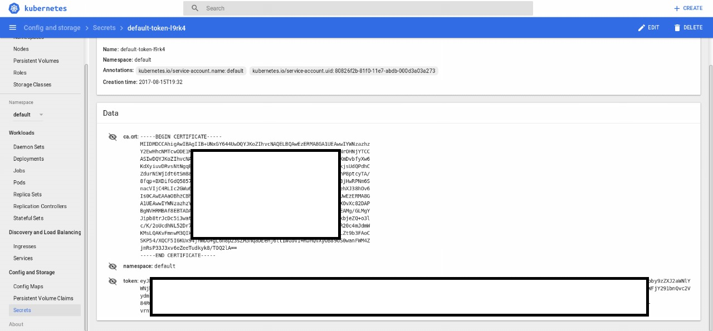
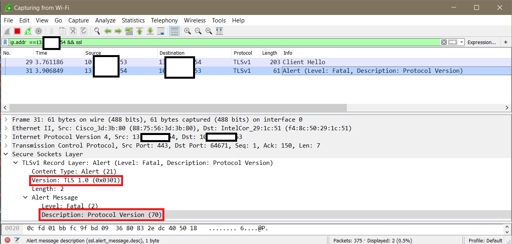
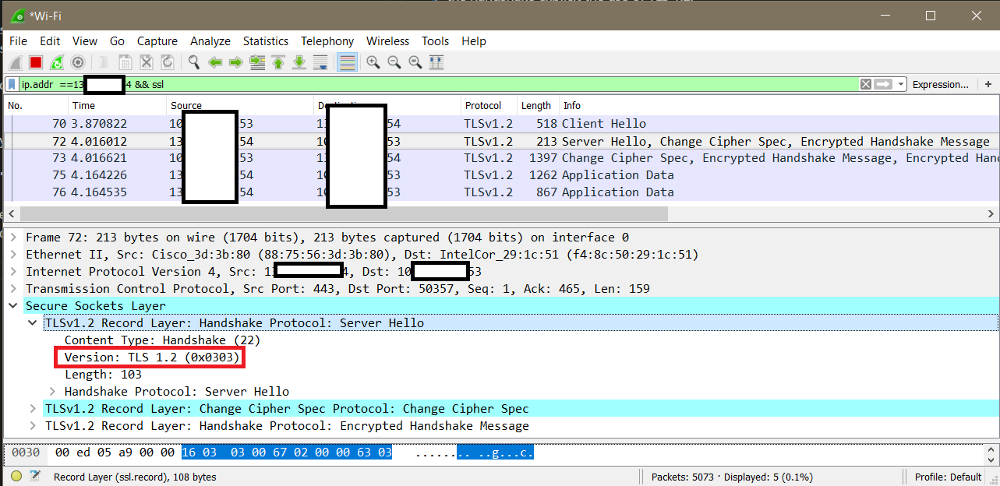
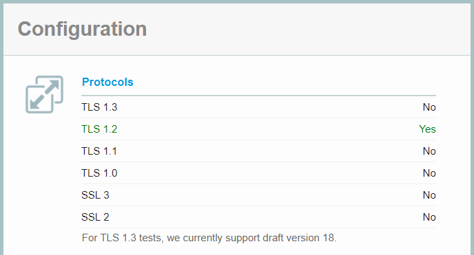
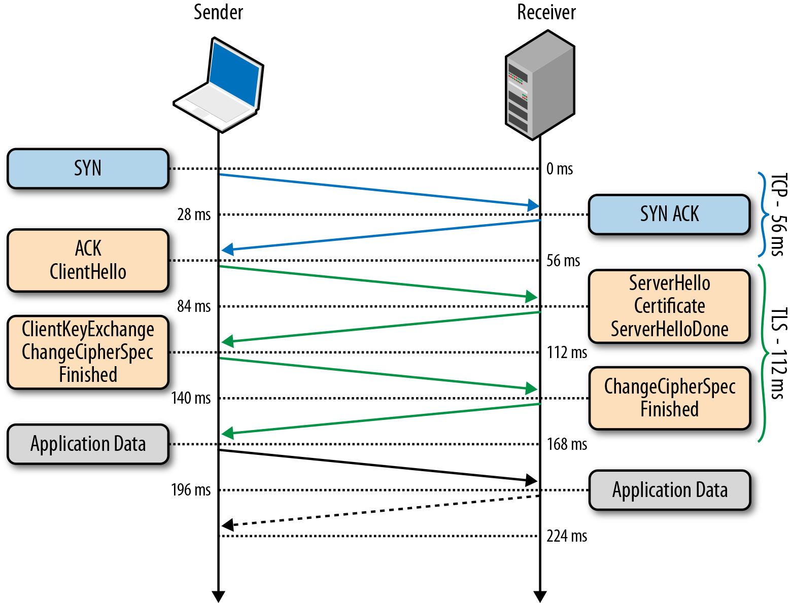

# Certificate Setup

## Process:

There are several ways to authenticate through kube-apiserver. The 2 most common ways are static tokens or client certificates.

 We are going to use static tokens due to Azure Functions restful behaviour (it is easier to add an *Authorization Header* than load a certificate from a *Store*).

 Besides that, Kubernetes deploys a self-signed certificate authority (CA) during installation. When making any HTTPS request to Kube API, every call will fail if the TLS channel is not secure and verified by this CA.

 In the following steps we are going to explore these authentication scenarios. We are going to setup the necessary certificates to make REST calls from a computer client. Also, we are going to get the **Static Token** and **CA Certificate** to use on the next steps in .NET projects.

### Linux (Ubuntu 16.04)

When accessing Kube UI, Secrets section, you will see:



Once *kubectl* is proper configured, you can get the same configuration using:
```bash
$ kubectl describe secret

Data
====
ca.crt:         1182 bytes
namespace:      7 bytes
token:          eyJhbGciOiJSUzI1NiIsInR5cCI6IkpXVCJ9.eyJpc3MiOiJrdWJlcm5ldGVzL3NlcnZpY2VhY2NvdW50Iiwia3ViZXJuZXRlcy5pby9zZXJ2aWNlYWNjb3VudC9uYW1lc3BhY2UiOiJkZWZhdWx0Iiwia3ViZXJuZXRlcy
[...]
jOGmjd7dBr57Ob_we4mWEGjHqlD565jlc7doFnc3c0-0UoToNiQAzqgrDJcotdTo6S_RnmweDSHrtiGKEtxdY46au3bZQHu84bB2i-LgjjCJs7NC9NT2yFegsH_NSH0yj-vrnfGZ7k52y0PequuXCSqlN4jQE5RnALv2G2qGXnI9nOz8o1U7eT432NrOV3r6ctKeTjrKOf5_m5ONbgaHAuXb_wfLAE-hPqiJRkWAX36VNt7qlLk9T_Rf8Dh2DcdE2qLso7Si9xE4SgUnkLqZC7bKgtx1OaxDT8CUA
```

> **- IMPORTANT:** Store this **Static Token**, we are going to use it on the next sections.

If you use a jwt token decoder, like https://jwt.io/, the decoded payload will be similar to:

```json
{
  "iss": "kubernetes/serviceaccount",
  "kubernetes.io/serviceaccount/namespace": "default",
  "kubernetes.io/serviceaccount/secret.name": "default-token-l9rk4",
  "kubernetes.io/serviceaccount/service-account.name": "default",
  "kubernetes.io/serviceaccount/service-account.uid": "9e8a663b-f208-4996-8e1f-c241549370d4",
  "sub": "system:serviceaccount:default:default"
}
```

You can use the following code to extract both token and server from config files: ([See Reference](https://kubernetes.io/docs/tasks/administer-cluster/access-cluster-api/#without-kubectl-proxy))

```bash
$ APISERVER=$(kubectl config view | grep server | cut -f 2- -d ":" | tr -d " ")

$ TOKEN=$(kubectl describe secret $(kubectl get secrets | grep default | cut -f1 -d ' ') | grep -E '^token' | cut -f2 -d':' | tr -d '\t')

$ curl $APISERVER/api --header "Authorization: Bearer $TOKEN" --insecure

{
  "kind": "APIVersions",
  "versions": [
    "v1"
  ],
  "serverAddressByClientCIDRs": [
    {
      "clientCIDR": "0.0.0.0/0",
      "serverAddress": "10.240.255.15:443"
    }
  ]
}
```

When calling from Kubernetes API using curl we used the --insecure flag (or -k), to ignore TTL verification, being exposed to Man-in-the-middle attacks. After removing it, we got:

```bash
$ curl $APISERVER/api --header "Authorization: Bearer $TOKEN"

curl: (60) server certificate verification failed. CAfile: /etc/ssl/certs/ca-certificates.crt CRLfile: none
More details here: http://curl.haxx.se/docs/sslcerts.html

curl performs SSL certificate verification by default, using a "bundle"
 of Certificate Authority (CA) public keys (CA certs). If the default
 bundle file is not adequate, you can specify an alternate file
 using the --cacert option.
If this HTTPS server uses a certificate signed by a CA represented in
 the bundle, the certificate verification probably failed due to a
 problem with the certificate (it might be expired, or the name might
 not match the domain name in the URL).
If you would like to turn off curl is verification of the certificate, use
 the -k (or --insecure) option.
```

We can see (using --verbose flag in curl) that behavior during the handshake:
```
*   Trying 123.123.23.254...
* Connected to pocmgmt.eastus2.cloudapp.azure.com (123.123.23.254) port 443 (#0)
* found 173 certificates in /etc/ssl/certs/ca-certificates.crt
* found 694 certificates in /etc/ssl/certs
* ALPN, offering http/1.1
* SSL connection using TLS1.2 / ECDHE_RSA_AES_128_GCM_SHA256
* server certificate verification failed. CAfile: /etc/ssl/certs/ca-certificates.crt CRLfile: none
* Closing connection 0
```

The [official documentation](https://kubernetes.io/docs/tasks/administer-cluster/access-cluster-api/#without-kubectl-proxy) says:
>When kubectl accesses the cluster it uses a stored root certificate and client certificates to access the server. (These are installed in the ~/.kube directory). Since cluster certificates are typically self-signed, it may take special configuration to get your http client to use root certificate.

We needed to do the mentioned special configuration. You can access these certificates using
```bash
cat /home/user/.kube/config

apiVersion: v1
clusters:
- cluster:
    certificate-authority-data: *data*
    server: https://pocmgmt.eastus2.cloudapp.azure.com
  name: pocmgmt
contexts:
- context:
    cluster: pocmgmt
    user: pocmgmt-admin
  name: pocmgmt
current-context: pocmgmt
kind: Config
preferences: {}
users:
- name: pocmgmt-admin
  user:
    client-certificate-data: *data*
    client-key-data: *data*
```

Every certificate data in this config file is encoded in base64. It carries Certification Authority (CA, Root) and both public and private client certificates. To decoded it, you should use some base64 util. For instance, the following CA certificate data:
```
LS0tLS1CRUdJTiBDRVJUSUZJQ0FURS0tLS0tDQpNSUlETURDQ0FoaWdBd0lCQWdJSUIrVU54R1k2NDRVd0RRWUpLb1pJaHZjTkFRRUxCUUF3RXpFUk1BOEdBMVVFQXd3SVlXTnphemh6DQpZMkV3SGhjTk1UY3dPREUxTURBd01EQXdXaGNOTVRrd09ERTFNREF3TURBd1dqQVRNUkV3RHdZRFZRUUREQWhoWTNOck9ITmpZVENDDQpBU0l3RFFZSktvWklodmNOQVFFQkJRQURn
[...]
SEd3UC9hSndrYmplWlErbzNsDQpjL0svMm9VY2RoTkw1MkRyNzB2RXF4WVNsb29FeEtyUWlvenhxZy9vbE5sMEVxby9odm9NcjQya212eXVDTmZnT0JSMjBjNG1KZG1XDQpLTXNMUUFLdkZtbndNM1FJa0hNQlhlanZhSHpyNFVsd29uRFpoN1MwWTlVVkErZ0luamI2M1ZIenhZVGlWaitvTGJMWnQ5YjNGQW9DDQpTS1A1NC9YUUNGNUk2S1V4OTRqSFdERytnTDZuOHAyM3NaTTNocWFERWVIajZ0dDFXR292MStST0hRVlh5T0I4OW9TMHdhbkZXTTRaDQpqbVJzUDMzSjN4djZlWmVlVHVka3lrOC9UT1EybEE9PQ0KLS0tLS1FTkQgQ0VSVElGSUNBVEUtLS0tLQ0K
```
After the command:
```bash
cat /home/user/.kube/config | grep certificate-authority-data | cut -f 2- -d ":" | tr "\"" " " | tr -d " "  | base64 --decode >> ca.crt
```
It is decoded in [PEM format](https://serverfault.com/questions/9708/what-is-a-pem-file-and-how-does-it-differ-from-other-openssl-generated-key-file):
```
-----BEGIN CERTIFICATE-----
MIIDMDCCAhigAwIBAgIIB+UNxGY644UwDQYJKoZIhvcNAQELBQAwEzERMA8GA1UEAwwIYWNzazhz
Y2EwHhcNMTcwODE1MDAwMDAwWhcNMTkwODE1MDAwMDAwWjATMREwDwYDVQQDDAhhY3NrOHNjYTCC
ASIwDQYJKoZIhvcNAQEBBQADggEPADCCAQoCggEBAIennB95jqKVrK9YJ8PTqf0/NrKmDvbfyXw6
KdXyiuvDRvsNtNgqEjFrqGyy99gHfoc1dJ83dGi33J7FGxShHW9jFVqFRrl3tDiew0kjsUdQPdhC
[...]
c/K/2oUcdhNL52Dr70vEqxYSlooExKrQiozxqg/olNl0Eqo/hvoMr42kmvyuCNfgOBR20c4mJdmW
KMsLQAKvFmnwM3QIkHMBXejvaHzr4UlwonDZh7S0Y9UVA+gInjb63VHzxYTiVj+oLbLZt9b3FAoC
SKP54/XQCF5I6KUx94jHWDG+gL6n8p23sZM3hqaDEeHj6tt1WGov1+ROHQVXyOB89oS0wanFWM4Z
jmRsP33J3xv6eZeeTudkyk8/TOQ2lA==
-----END CERTIFICATE-----
```

> **- IMPORTANT:** Store this **CA Certificate**, we are going to use it on the next sections.

You can make the call in 2 ways, either temporarily use a flag on curl pointing to the CA cert or permanently add the CA cert to the certificates path.

#### Option 1: Use the --cacert option:
```bash
$ curl $APISERVER/api --header "Authorization: Bearer $TOKEN" --cacert /home/user/ca.crt

{
  "kind": "APIVersions",
  "versions": [
    "v1"
  ],
  "serverAddressByClientCIDRs": [
    {
      "clientCIDR": "0.0.0.0/0",
      "serverAddress": "10.240.255.15:443"
    }
  ]
}
```


#### Option 2: Add the CA certs File:

Add it to CA certs file (using root user):
```bash
$ sudo su
$ cat /home/user/ca.crt >> /etc/ssl/certs/ca-certificates.crt
```

Call the API without the insecure flag:
```bash
$ curl $APISERVER/api --header "Authorization: Bearer $TOKEN"

{
  "kind": "APIVersions",
  "versions": [
    "v1"
  ],
  "serverAddressByClientCIDRs": [
    {
      "clientCIDR": "0.0.0.0/0",
      "serverAddress": "10.240.255.15:443"
    }
  ]
}
```

### Windows
The same process of adding the CA could be done in order to make calls from HTTP clients, like Invoke-WebRequest or Postman, for instance. You can also setup your client programs to temporarily use a chain of certificates.

#### Steps to add it permanently:
* Install the CA cert under *Trusted Root Certification Authorities* store  and check it by certmgr.exe tool.
* Use Invoke-WebRequest:
```ps
[Net.ServicePointManager]::SecurityProtocol = [Net.SecurityProtocolType]::Tls12
Invoke-WebRequest $URL -Headers @{"authorization"="bearer " + $TOKEN}
```
> By default in .NET 4.5, Invoke-WebRequest uses TLS 1.0. When sniffing the packages with Wireshark, we can see the handshake explicit the use of TLS 1.2:
>
>
>

> You can also make an amazing TLS support test using this tool: https://www.ssllabs.com/ssltest/. You will be able to get much more information about the host.
>

Some common errors (from PS/.NET):
* "Invoke-WebRequest : The request was aborted: Could not create SSL/TLS secure channel."
  * *Possible Reason*: TLS protocol version.
  * *Possible Solution*: Change TLS client version. Check the [reference](https://msdn.microsoft.com/en-us/library/system.net.securityprotocoltype(v=vs.110).aspx)
* "Invoke-WebRequest : The underlying connection was closed: Could not establish trust relationship for the SSL/TLS secure channel."
  * *Possible Reason*: CA certificate not installed.
  * *Possible Solution*: Install the CA certificate or validate the Certificate chain on other client.

### References
* [TLS 1.2 and .NET Support: How to Avoid Connection Errors](http://blogs.perficient.com/microsoft/2016/04/tsl-1-2-and-net-support/)
* TLS handshake process (without client certificate):
  

  *Source: [High Performance Browser Networking](http://chimera.labs.oreilly.com/books/1230000000545/ch04.html#TLS_HANDSHAKE)*